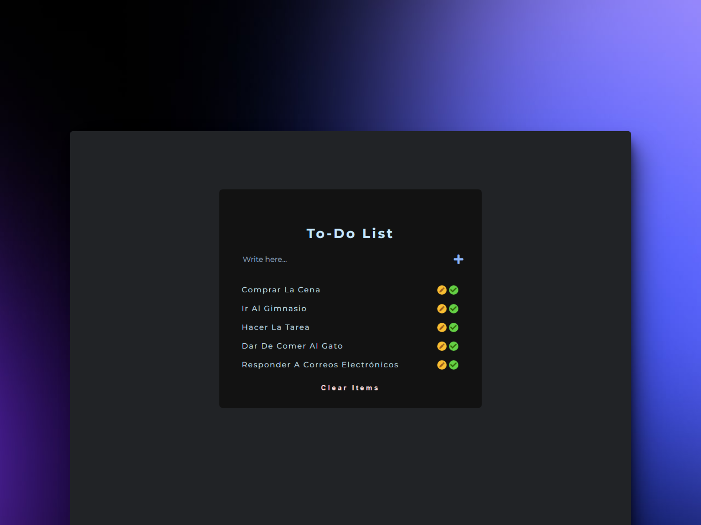

  
# ✔ HTML, CSS and JavaScript: To-Do List

> 🧩 Aquí puedes ver su [**Live Demo.**](https://to-do-list-abraham.netlify.app/)

## 🚀 Descripción

Este proyecto es una **Lista de Tareas** hecha con **HTML**, **CSS** y **JavaScript** de manera totalmente vanilla.

## 🎭 Tecnologías

El proyecto utiliza las siguientes tecnologías:

- Manejo del **DOM** con JavaScript.
- **EventListener**.
- **Persistencia** de datos con el **LocalStorage.**
